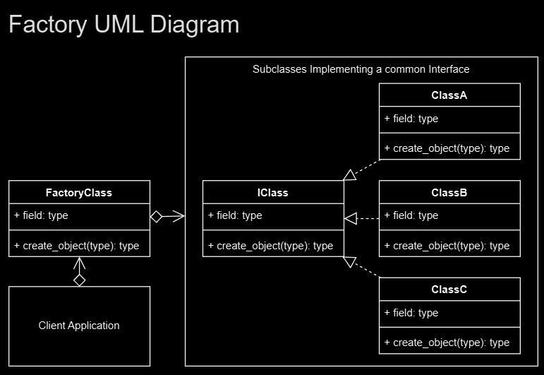

## The Factory pattern is really about adding that extra abstraction between the object creation and where it is used. 
## This gives you extra options that you can more easily extend in the future.

## Terminology
### Concrete Creator: The client application, class or method that calls the Creator (Factory method).

### Product Interface: The interface describing the attributes and methods that the Factory will require in order to create the final product/object.

### Creator: The Factory class. Declares the Factory method that will return the object requested from it.

### Concrete Product: The object returned from the Factory. The object implements the Product interface.

